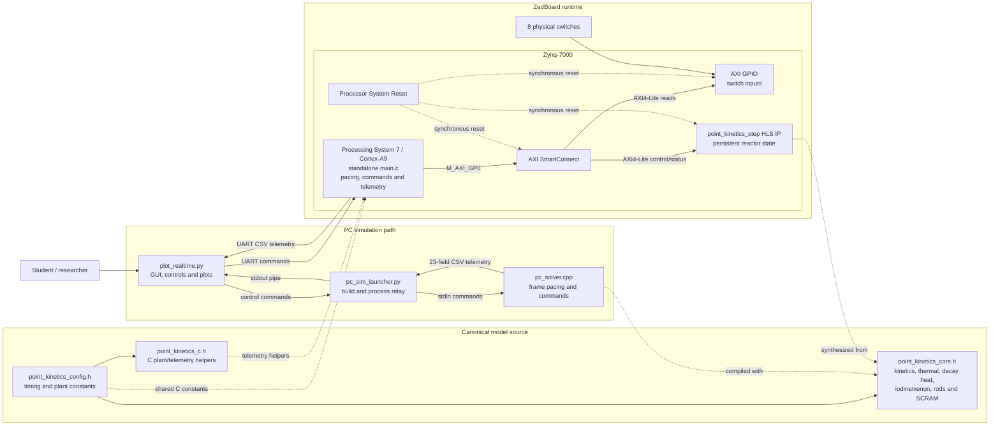
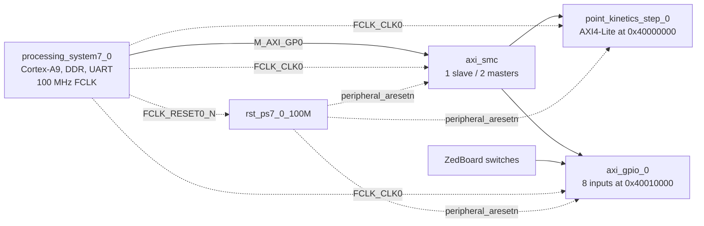
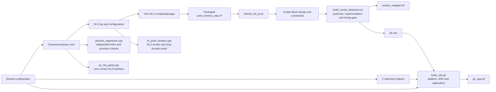

# Project architecture

## Runtime architecture

The PC and FPGA paths execute the same `pk::ReactorState` equations from the
canonical core. The ARM application does not duplicate the physics solver: it
selects the timestep and substep count, writes commands to the HLS register
map, waits for completion, reads outputs, and emits telemetry using shared C
plant helpers.

One output frame follows this sequence:

1. The GUI, UART, or board switches provide an operator command.
2. The PC host or ARM application selects `h` and the bounded substep count.
3. The shared core advances neutron power, six precursors, decay heat,
   temperatures, rods, and time one substep at a time.
4. Iodine and xenon are updated once per frame using average neutron power.
5. The PC host or ARM application emits the same 23-field CSV schema.
6. The plotter displays state, feedback components, rod position, achieved
   compression, timestep, plant mode, and SCRAM status.

## FPGA block design

## Build and verification pipeline

Generated HLS output, Vivado runs, bitstreams, XSA files, Vitis platforms, and
ELF files are build artifacts. The versioned sources are the common model,
wrappers, application, block-design metadata, constraints, tests, and build
scripts.

## Component responsibilities

| Component | Responsibility |
| --- | --- |
| `point_kinetics_config.h` | Cross-target timing, feedback, rod-worth, SCRAM and decay-heat constants |
| `point_kinetics_core.h` | Canonical reactor state and numerical update methods |
| `point_kinetics_c.h` | C plant coefficients and critical-rod helpers for ARM telemetry |
| `point_kinetics.cpp/.h` | HLS AXI interface and persistent FPGA state |
| `pc_solver.cpp` | PC command handling, frame pacing and telemetry |
| `main.c` | ARM control of HLS IP, physical switches, UART and telemetry |
| `plot_realtime.py` | PC/serial input, controls, plots and status presentation |
| Vivado block design | PS7, AXI interconnect, HLS accelerator, GPIO, clock and reset integration |
| Regression tests | Numerical precision, reference comparison and PC/HLS parity |

